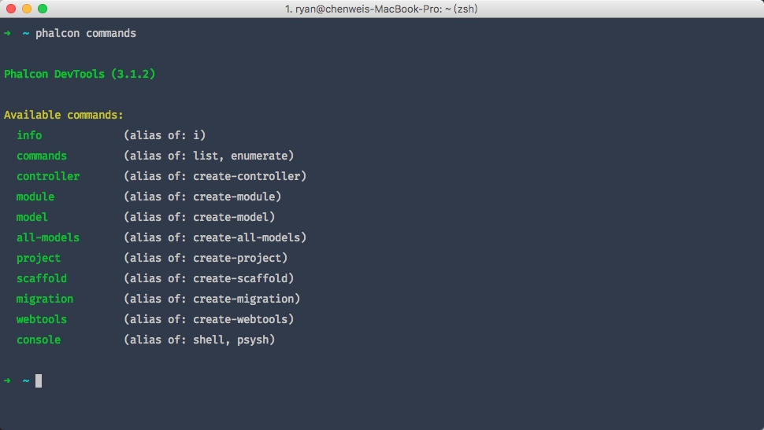
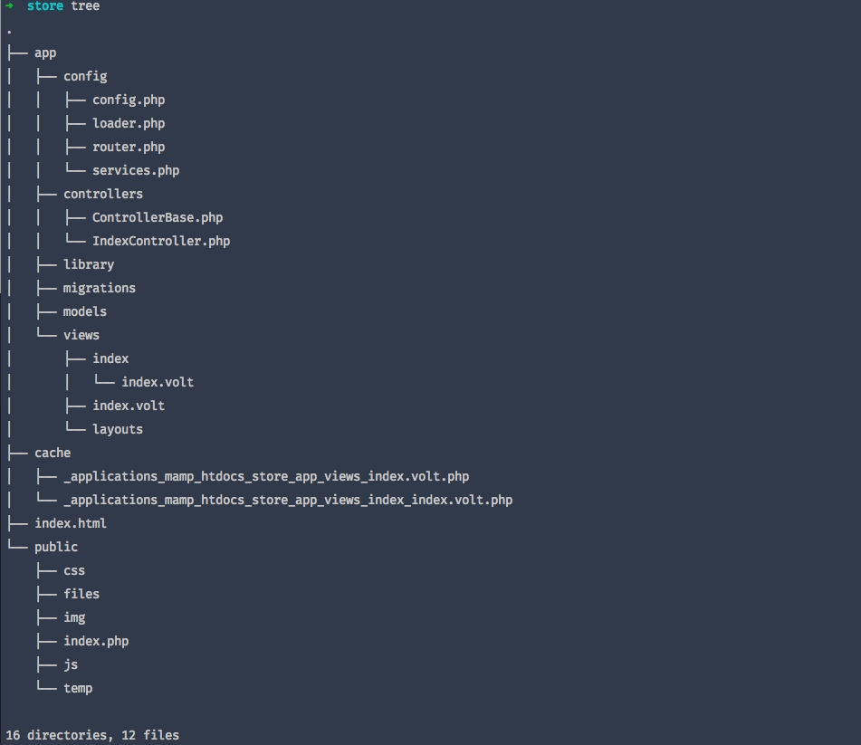
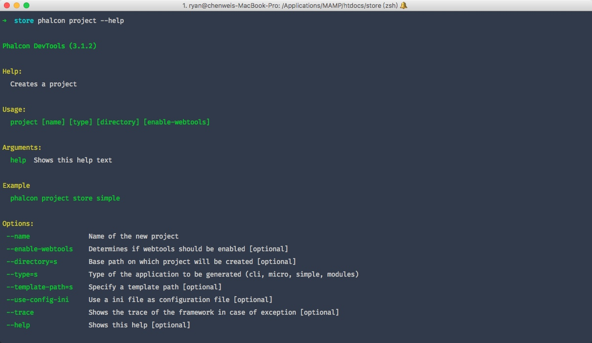
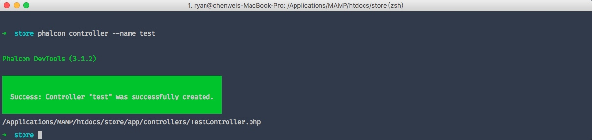

```markdown

## 二、开发工具

### 2.1 下载 

我们可以从 [Github](https://github.com/phalcon/phalcon-devtools) 上下载或克隆下来这个跨平台的开发辅助工具

### 2.2 安装（Installation）

下面详尽的说明了如何在不同的操作系统平台上安装这个辅助开发工具：

* [Windows 系统下使用 Phalcon 开发工具（Phalcon Developer Tools on Windows）](http://www.iphalcon.cn/reference/wintools.html)
* [Mac OS X 系统下使用 Phalcon 开发工具（Phalcon Developer Tools on Mac OS X）](http://www.iphalcon.cn/reference/mactools.html)
* [Linux 系统下使用 Phalcon 开发工具（Phalcon Developer Tools on Linux）](http://www.iphalcon.cn/reference/linuxtools.html)

### 2.3 获取可用的命令


```bash
phalcon commands
```




### 2.4 生成项目框架

我们可以使用Phalcon开发辅助工具生成预先定义的项目架构。 默认情况下，phalcon开发辅助工具会使用apache的mod_rewrite来生成程序的骨架. 要创建项目我们只需要在我们的 web服务器根目录下输入如下命令：

```bash
$ phalcon create-project store
```



### 2.5 查看帮助

同其他linux命令 --help

```shell
phalcon project --help
```



### 2.6 生成控制器

1. phalcon create-controller –name test
2. phalcon controller –name test



### 2.7 数据库配置

在新版本的phalcon工具中，新生成的配置文件为**config.php**

### 2.8 生成模型

1. phalcon model products
2. phalcon model --name tablename

<!--
CREATE TABLE `products` (
  `id` int(11) unsigned NOT NULL AUTO_INCREMENT,
  `typesId` int(10) DEFAULT NULL,
  `name` varchar(30) DEFAULT NULL,
  `price` int(11) DEFAULT NULL,
  `quantity` int(1) DEFAULT NULL,
  `status` tinyint(1) DEFAULT NULL,
  PRIMARY KEY (`id`)
) ENGINE=InnoDB DEFAULT CHARSET=utf8;
-->

```php
class Products extends Model
{
    /**
     * @var integer
     */
    public $id;

    /**
     * @var integer
     */
    public $typesId;

    /**
     * @var string
     */
    public $name;

    /**
     * @var string
     */
    public $price;

    /**
     * @var integer
     */
    public $quantity;

    /**
     * @var string
     */
    public $status;
}
```

使用phalcon开发辅助工具我们可以有若干种方式来生成模型。 可以有选择的生成若干个模型或是全部生成。 亦可以指定生成公有属性或是生成setter和getter方法。

Options:


| options | 说明 |
| --- | --- |
| --name=s | Table name 表名 |
| --schema=s | Name of the schema. [optional] schema名 |
| --namespace=s | Model’s namespace [optional] 模型命名空间 |
| --get-set | Attributes will be protected and have setters/getters. [optional] 设置字段访问属性为私有 并添加setters/getters方法 |
| --extends=s | Model extends the class name supplied [optional] 指定扩展类名 |
| --excludefields=l | Excludes fields defined in a comma separated list [optional] |
| --doc | Helps to improve code completion on IDEs [optional] 辅助IDE的自动完成功能 |
| --directory=s | Base path on which project will be created [optional] 项目的根目录 |
| --force | Rewrite the model. [optional] 重写模型 |
| --trace | Shows the trace of the framework in case of exception. [optional] 出错时显示框架trace信息 |
| --mapcolumn | Get some code for map columns. [optional] 生成字映射的代码 |
| --abstract | Abstract Model [optional] 抽象模型 |


### 2.9 生成基本的 CRUD

使用phalcon开发辅助工具我们可以直接快速的生成一个模型的CRUD操作。 如果我们想快速的生成模型的CRUD操作只需要使用phalcon辅助开发工具的中scaffold命令即可。

代码生成后，你可以根据自己的需要修改生成的代码。很多开发者可能不会去使用这个功能，其实这东西有时不是太好用，很多时候开发者往往会手动的书写相关代码。使用scaffold产生的代码可以 帮助我们理解框架是如何工作的当然也可以帮助我们制作出快速原型来。 下面的截图展示了基于products表的scaffold:

```bash
phalcon scaffold --table-name products
```

### 2.10 工具的 Web 界面

基本不会用到，略过，感兴趣的自己研究下

### 2.11 集成工具到 PhpStorm

见视频

```


